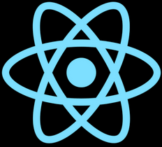
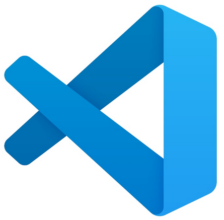
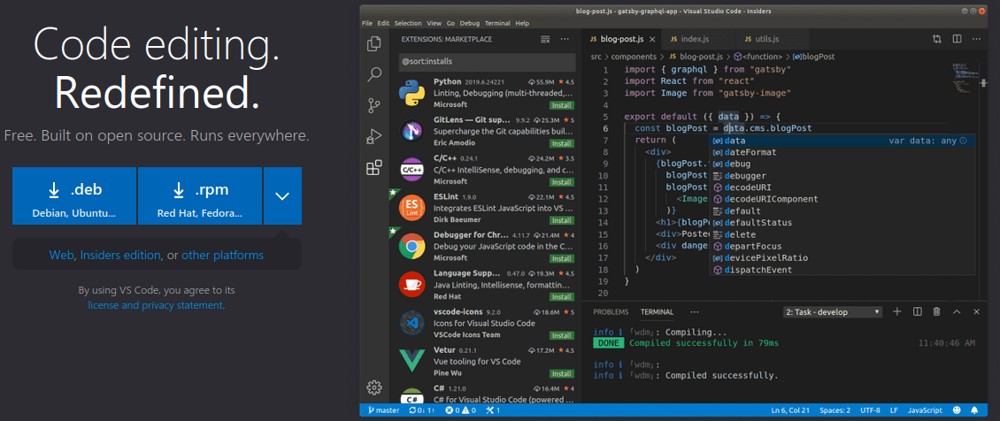
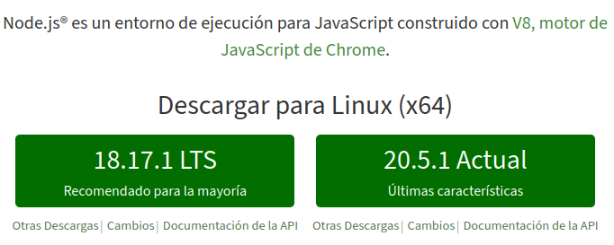
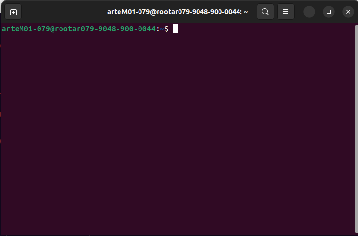
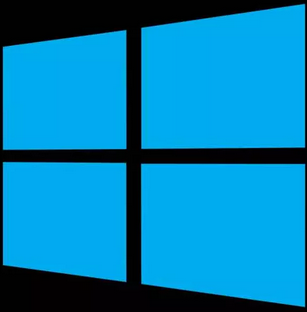
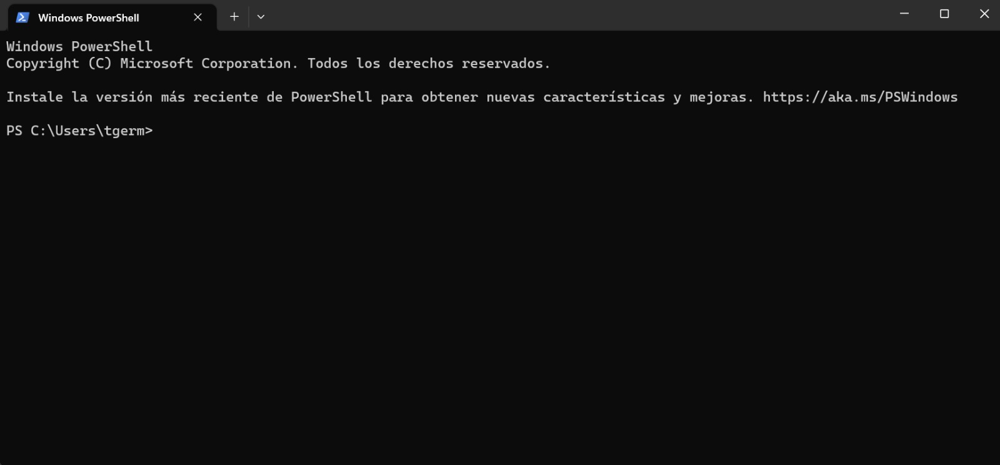

# INTRODUCCION REACT.JS 

REACT es una biblioteca 📖 para crear interfaces de usuarios web y nativas. ES una biblioteca de javascript

este lenguaje se usa para la creacion de paginas web como <strong> Netflix </strong> cuando vamos por sitios web de este tipo nos encontramos con animaciones veras que todas las transiciones son suaves casi instantaneas y nunca tienes el efecto en el que parece que se carga nuevamente la pagina por lo que parece esperar a que una nueva pagina se de vuelta por el servidor hasta cierto punto. 

<strong> REACT al ser una librebria javascript utiliza javascript en el navegador para actualizar la pagina y la interfaz de usuario que vemos en esa pagina </strong>

## Que se necesecita?

para poder trabajar con react se necescita conocimientos en "JAVASCRIPT" 

# Diferencias de JAVASCRIPT 🆚 REACT

<li>JavaScript es el lenguaje de programación que permite crear interactividad en las páginas web.

<li>React es una biblioteca de JavaScript que facilita la construcción de interfaces de usuario reutilizables y dinámicas al enfocarse en la creación de componentes.

# estrategia de aprendizaje

<li> 🎞️ Ver videos a tu ritmo, repasar y repertir los videos cuantas veces sea necesario 

<li> 🖥️ Codifica y practica haciendo tus propios proyectos 

<li> 👥 Pide ayuda siempre que lo nececites 

# Como crear proyectos

## ⚙️ Local Setup
Podemos crear proyectos localmente en su sistema, de modo que todos los archivos del proyecto se creen en su dico duro y cualquier software necesario para ejercutar ese proyecto se instale en su sistema. 

Por lo tanto se debe instalar cualquir herramienta o paquete que se requiera para ejecutar un proyecto y debes tener   todos estos archivos de proyecto en tu sistema

## 💻 Browser-based Setup
Podemos optar tambien por una solucion basada en nevegador, una solucion de proyecto remoto. 

Al usar una solucion remota no necesitamos instalar nada en tu sistema local y no necesitas crear ningun archivo en tu sistema local. En su lugar, todos los archivos del proyecto REACT, asi como cualquier herramienta adicional que pueda ser necesaria entre bastidores, seran proporcionados y alejados or ese proveedor de proyectos remotos.

## Editor de codigo que puedes usar

<li> <strong> Visual Studio Code (VSCode): </strong> Desarrollado por Microsoft, es uno de los editores de código más populares. Ofrece una amplia gama de extensiones y es altamente personalizable. Es adecuado para una variedad de lenguajes y tipos de proyectos.

  

## INSTALAR NODE.JS

Para ejecutar este proyecto REACT e iniciar un sevidor de desarrollo que te permita previsualizar la aplicacion de REACT mientras trabajas con ella, sin embargo necesitas instalar NODE.JS 

<strong> CODIGO DE INSTALACION EN LINUX </strong>

<li> npm install node
<li> npm use node 

<h3>para usar la version 20</h3>

<li> npm install 20
<li> npm use 20

(si no tiene la contraseña del admin puedo remplazar <strong>NPM</strong> por <strong>NVM</strong> )

ahora si deseas ejecutar una instantanea del proyecto descargado, tiene que abirir la terminal de Visaul Studio Code ( VSC ) o simbolo del sistema

  

 
  

 

## RESUMEN-REACT

REACT se basa en componentes y en la contruccion de estos componentes que se combinan entre si. React te permite crear estos componentes reutilizables y reactivos que consisten en HTML y JavaScript y tambien un poco de CSS.

<strong>ENFOQUE DECLARATIVO</strong>
react utiliza algo que se llama enfoque declarativo para la contruccion de estos componentes

Un Componente en React no es mas que una funcion JAVASCRIPT